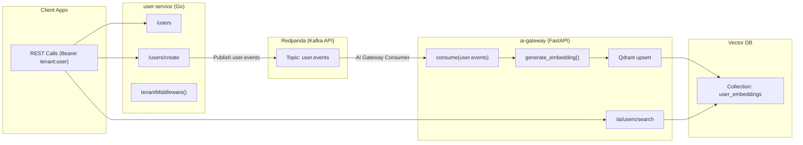
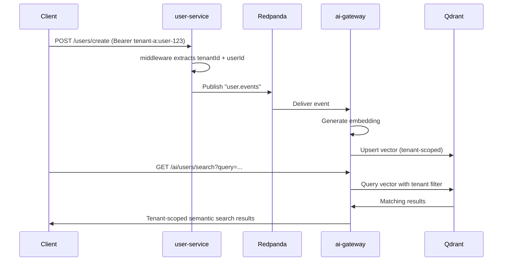

# DistributedAI Event Mesh – Architecture Overview

This document describes the high-level system architecture of the **DistributedAI Event Mesh**, a research-grade backend designed to explore:

- Event-driven microservices  
- Multi-tenant SaaS patterns  
- AI enrichment pipelines  
- Vector search (semantic search)  
- Streaming systems (Kafka / Redpanda)  
- Cross-service communication  
- Scalable API boundaries  

The goal is to simulate a **modern AI platform backend** using lightweight services that can be deployed locally or extended to cloud infrastructure (Kubernetes, Terraform, etc.).

## High-Level Diagram



## Components

### 1. **user-service (Go)**  
A stateless microservice responsible for:

- Serving tenant-scoped REST APIs  
- Creating users  
- Publishing domain events into Kafka  
- Enforcing multitenancy via middleware  
- Returning tenant-filtered lists  

#### Endpoints
| Endpoint | Description |
|---------|-------------|
| `GET /health` | No auth; service liveness |
| `GET /users` | Returns tenant-scoped user list |
| `POST /users/create` | Creates user + publishes `user.events` |

### 2. **Event Mesh (Redpanda / Kafka)**

- Streaming backbone  
- Decouples microservices  
- Powers asynchronous AI enrichment  

### 3. **ai-gateway (FastAPI)**  

Handles:
- Consuming `user.events`  
- Generating embeddings  
- Storing vectors in Qdrant  
- Semantic search  
- Tenant-aware API access  

### 4. **Qdrant Vector DB**

Stores embeddings with tenant-based payload filtering.

Example stored point:
```json
{
  "id": "tenant-a:123",
  "vector": [...],
  "payload": {
    "tenantId": "tenant-a",
    "userId": 123,
    "email": "alice@tenant-a.dev",
    "name": "Alice"
  }
}
```

Search queries always filter by tenant.

## Multitenancy Model

Two layers:

### 1. API Boundary Enforcement
Authorization header:
```
Bearer tenant-a:user-123
```
Parsed into tenant context.

### 2. Data-Layer Enforcement  
Qdrant payload filters ensure cross-tenant isolation even within a shared collection.

## Event Flow Summary



## Why This Architecture Matters

Demonstrates:
- Event-driven design  
- Multi-tenant architecture  
- AI/vector search integration  
- Extensible AI pipelines  
- Cloud-readiness  

## Next Steps

- Real embeddings (OpenAI, local models)  
- Per-tenant rate limits  
- K8s deployment  
- Terraform infra  
- Observability (Prom/Grafana)  
