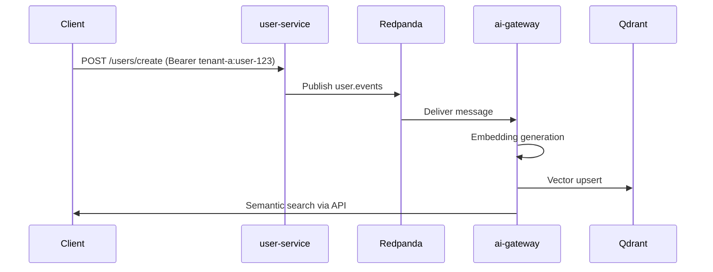

# Event Model & Event Flow – DistributedAI Event Mesh

This document details the **event schema, lifecycle, and flow** used inside the DistributedAI Event Mesh.

## Overview

Events are the backbone of the system, enabling:

- Microservice decoupling  
- Asynchronous AI enrichment  
- Multi-tenant propagation  
- Vector indexing pipelines  
- Scalable distributed architectures  

All domain events flow through **Redpanda (Kafka API)**.

---

# 1. Event Naming Convention

Events follow the pattern:

```
<entity>.<action>
```

Current event:

```
user.created
```

Topic name:

```
user.events
```

---

# 2. Event Schema

Example published event:

```json
{
  "id": 123,
  "email": "alice@tenant-a.dev",
  "name": "Alice A",
  "tenantId": "tenant-a"
}
```

### Event guarantees:
- Carries required tenant identity  
- Contains enough fields for embedding & semantic indexing  
- Fully self-contained → no DB lookups required by consumers  

---

# 3. Event Publishing (user-service)

Triggered by:

```
POST /users/create
Authorization: Bearer tenant-a:user-123
```

Steps:
1. Tenant extracted via middleware  
2. User object constructed  
3. Event payload serialized  
4. Published to `user.events`  

Producer code:

```go
writer.WriteMessages(ctx, kafka.Message{ Value: eventBytes })
```

---

# 4. Event Consumption (ai-gateway)

For each incoming message:
1. Deserialize JSON  
2. Generate deterministic embedding  
3. Upsert into Qdrant with tenantId payload  
4. Log success  

Consumer loop:

```python
async for msg in consumer:
    data = json.loads(msg.value)
    emb = generate_embedding(...)
    qdrant.upsert(...)
```

---

# 5. Event Flow Diagram



---

# 6. Benefits of Event Architecture

- Decouples ingestion from AI processing  
- Easy scaling: add more consumers  
- Service failures don’t block user requests  
- Extensible for new domains: orders, tasks, invoices, logs  

---

# 7. Future Event Types

```
user.updated
user.deleted
tenant.created
billing.usage.incremented
task.created
task.completed
```

---

This event model mimics real AI SaaS backends while remaining simple and developer-friendly.
