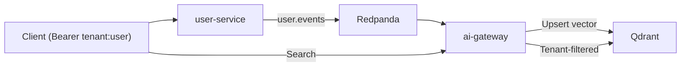

# Multitenancy Model – DistributedAI Event Mesh

This document explains how **tenant isolation**, **authentication boundaries**, and **data-layer filtering** work across the platform.

Multitenancy is enforced at **three layers**:

1. **API Boundary** (JWT-like token simulation)  
2. **Event Payload** (Kafka messages include tenantId)  
3. **Vector DB Filtering** (Qdrant payload filter)  

Together, these protect tenant data across HTTP APIs, streaming systems, and AI pipelines.

---

# 1. Tenant Identity Format

Development token format:

```
Authorization: Bearer tenant-a:user-123
```

→ Translates to:

```json
{
  "tenantId": "tenant-a",
  "userId": "user-123"
}
```

In production → JWT with signature, expiry, claims.

---

# 2. API Boundary Enforcement

## user-service (Go)

Middleware:

```go
tenant := getTenantInfo(r)
if tenant == nil { return 401 }
```

Responsibilities:
- Validate token format  
- Extract tenantId and userId  
- Inject into request context  

Protected routes:
- `/users`
- `/users/create`

---

## ai-gateway (FastAPI)

Dependency:

```python
tenant = Depends(get_tenant_context)
```

Behavior:
- Rejects missing/invalid token  
- Makes tenant context available to handlers  
- Ensures searches are tenant-scoped  

---

# 3. Event-Layer Multitenancy

Events ALWAYS include:

```json
{ "tenantId": "tenant-a", ... }
```

Why?
- Headers aren’t preserved across Kafka  
- Consumer must reconstruct tenant context  
- Allows horizontally-scaled consumers  

This mirrors architecture from companies like:
- Stripe  
- Shopify  
- Notion  
- Intercom  

---

# 4. Data-Layer Multitenancy (Qdrant)

Stored vector point:

```json
{
  "id": "tenant-a:123",
  "payload": {
    "tenantId": "tenant-a",
    "userId": 123
  }
}
```

Search queries enforce tenant isolation:

```json
{
  "must": [
    { "key": "tenantId", "match": { "value": "tenant-a" } }
  ]
}
```

Result:
- Tenant A cannot access Tenant B embeddings  
- Even though all data lives in the same collection  

---

# 5. Full Multitenant Flow



---

# 6. Extension Points

Future improvements that integrate naturally:

### ✔ Tenant-specific quotas  
Limit embedding writes or search requests.

### ✔ Tenant-specific rate limits  
Redis or API gateway.

### ✔ Tenant-specific collections  
Each tenant gets its own Qdrant namespace.

### ✔ Cross-tenant analytics  
Still isolated per-tenant, aggregated at a higher layer.

---

# 7. Why This Works

This model supports:
- Horizontal scalability  
- Stateless microservices  
- Zero shared global state  
- Strong isolation guarantees  
- Light overhead  
- AI-first architectures  

It is simple enough for demos, yet realistic for enterprise SaaS environments.
